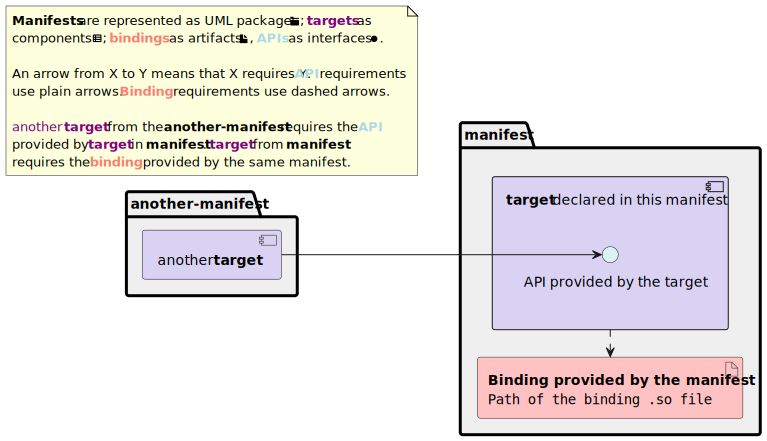

# manifest-parser

Subcommands:

- check: verify and lint a manifest file
- graph: generate a PlantUML graph showing how multiple manifests interact with each other
- explain: generate a Markdown-formatted explanation of what a manifest file declares

The tool uses `argparse` to parse the command line options and arguments. That
means the `--help` is always up to date and exhaustive; use it!

## Check

This subcommand valides one or multiple YAML files against a [JSON Schema][json-schema] (which can
be found in the source directory) matching the redpesk's application framework [`manifest.yml`
specification][manifest-doc]. It only verifies correctness to the specification, it does not check
if multiple manifests interact as intended!

If all manifests are correct, the program will exit with an error code of `0`. If at least one
manifest has an error, the error code will be `1`.

### Sample output of checking correct manifests

```log
> manifest-parser check ../evse-project-manager-config/*/manifest.yml
INFO     Schema loaded from /home/lbs/Documents/hygarde/manifest-parser/manifest_parser/manifest.schema.json
INFO     Validated ../evse-project-manager-config/afb-mqtt-ext/manifest.yml
INFO     Validated ../evse-project-manager-config/afb-ocpp-ext/manifest.yml
INFO     All manifests are valid
> echo $?
0
```

### Sample output of checking an incorrect manifest (how to read errors)

```log
> manifest-parser check ../evse-project-manager-config/*/manifest.yml
INFO     Schema loaded from /home/lbs/Documents/hygarde/manifest-parser/manifest_parser/manifest.schema.json
ERROR    Validation failed for ../evse-project-manager-config/afb-mqtt-ext/manifest.yml
Traceback (most recent call last):
  File "/home/lbs/Documents/hygarde/manifest-parser/manifest_parser/check.py", line 29, in check_one
    jsonschema.validate(manifest, schema)
  File "/usr/lib/python3.12/site-packages/jsonschema/validators.py", line 1307, in validate
    raise error
jsonschema.exceptions.ValidationError: 'application/vnd.agl.resource' is not one of ['application/vnd.agl.native', 'application/vnd.agl.service', 'application/x-executable', 'application/vnd.redpesk.resource', 'application/vnd.redpesk.httpd']

Failed validating 'enum' in schema['properties']['targets']['items']['properties']['content']['properties']['type']:
    {'description': 'Type of content',
     'enum': ['application/vnd.agl.native',
              'application/vnd.agl.service',
              'application/x-executable',
              'application/vnd.redpesk.resource',
              'application/vnd.redpesk.httpd'],
     'type': 'string'}

On instance['targets'][0]['content']['type']:
    'application/vnd.agl.resource'
WARNING  At least one manifest isn't valid, look for errors in above logs
> echo $?
1
```

The library used to validate data against a JSON Schema returns errors as Python exception, which
can be a bit difficult to read. Here, the `ERROR` line tells us in which file there's an error.
Then, the `On instance['targets'][0]['content']['type']` line towards the end tells us where the
problem is using a JSON path: the content type of the first target of this manifest (its value is
given on the line just below). Finally, the block over that starting with `Failed validating`
explains the error: the value used does not meet the `enum` requirement, which specifies a strict
list of correct values.

Some errors make the JSON Schema validation library dump the whole schema and the incorrect manifest
in the terminal all at once. That usually is because a key is used at the root of the manifest which
should instead be in a target, or simply that there is a typo. The most understandable line of the
error will be the line starting with `jsonschema.exceptions.ValidationError` towards the start; it
will tell you the faulty key.

## Graph

This subcommand generates a diagram showing the interactions between a list of manifests, more
specifically which manifest/target provides and requires what bindings/APIs. The program will write
the diagram description in an intermediary `.puml` file, call PlantUML with the `-tsvg` flag to
convert that to an `.svg` image, and by default, if everything happened as intended, delete the
intermediary file.

PlantUML manages the layout, there is very little room to tweak it. However, you can keep the
intermediary file, edit it and render it manually using the `--keep-puml` flag.

### Diagram legend



## Explain

Not implemented yet

[json-schema]: https://json-schema.org/learn/getting-started-step-by-step
[manifest-doc]: https://docs.redpesk.bzh/docs/en/master/developer-guides/manifest.yml.html
